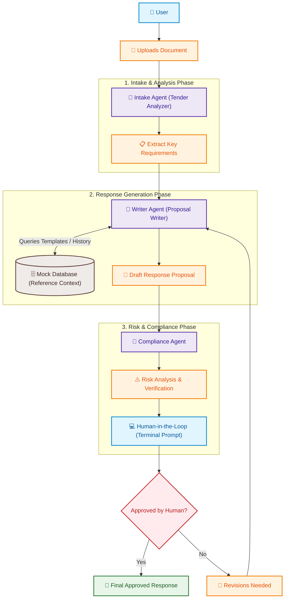

# Tender AI Multi-Agent System

A multi-agent system built using the Google Agent Development Kit (ADK) to analyze tenders, proposals, and draft professional business responses.

## System Architecture

Below is the flowchart representing the Tender AI multi-agent workflow, demonstrating how documents are ingested, drafts are generated using reference data, and compliance checks are enforced with a human-in-the-loop review.



## Setup Instructions

1. **Prerequisites**:
   - Python 3.10 or higher
   - API access to Google Gemini models (set `GEMINI_API_KEY`)

2. **Virtual Environment**:
   Ensure the virtual environment is set up and active:
   ```bash
   # Windows PowerShell
   .venv\Scripts\activate
   ```

3. **Install Dependencies**:
   ```bash
   pip install -r requirements.txt
   ```

4. **Environment Variables**:
   Copy `.env` and set your Google Gemini API Key:
   ```bash
   # Add your key to .env
   GEMINI_API_KEY=your-api-key-here
   ```

## Running the Application

To run the default workflow:
```bash
python main.py
```

## Project Structure

- `src/` - Application source code
  - `agents/` - Custom ADK Agents (e.g. `TenderAnalyzer`, `ProposalWriter`)
  - `workflows/` - Orchestration logic connecting agents
  - `tools/` - Reusable functions and tools utilized by agents
- `main.py` - Main runner script
